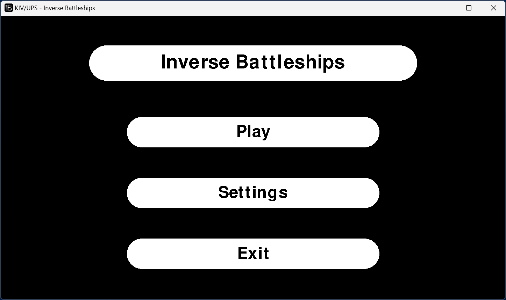

# Inverse Battleships — Multiplayer Game in Python & Go

This repository contains a simple multiplayer game inspired by the classic Battleships, but with inverted rules.  
The client is implemented in **Python** using **pygame** for rendering, and the server is implemented in **Go** for fast and efficient network handling.

For detailed information about the project, please refer to the [documentation](./docs/doc.md).

## Features
- Two-player turn-based gameplay.
- Shared 9×9 board with inverted ship rules:
  - Capture unclaimed ships.
  - Destroy opponent’s ships.
  - Empty shots do nothing.
- Custom TCP-based protocol.
- Cross-platform (Unix & Windows) with provided Makefiles.
- GUI client built with pygame.

