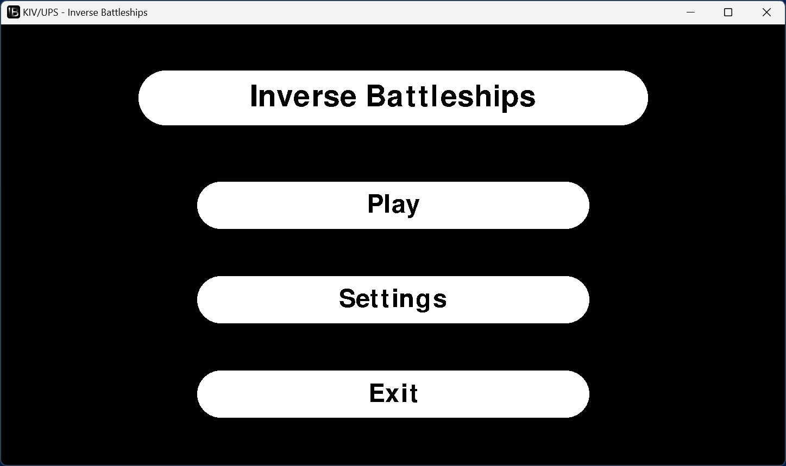
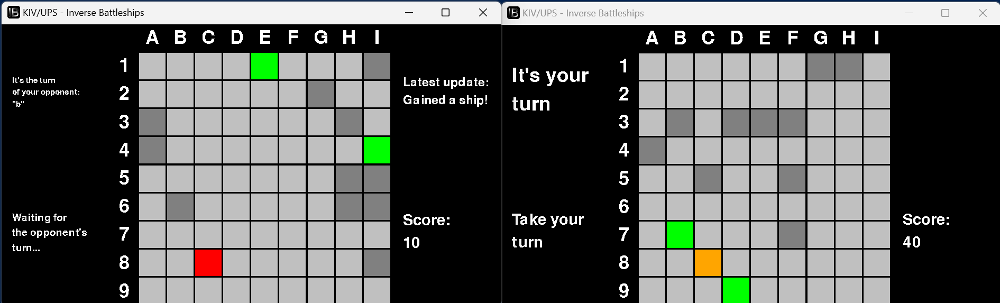
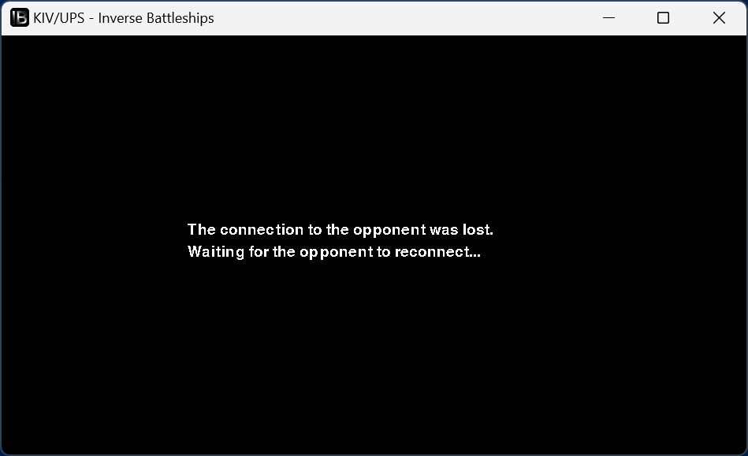
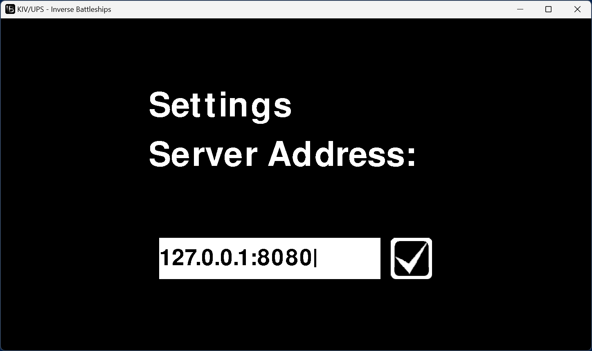

# Inverse Battleships (Inverzní lodě) — hra pro více hráčů v Pythonu & Go

Tento repozitář obsahuje jednoduchou hru pro více hráčů inspirovanou klasickými Loděmi, avšak s obrácenými pravidly.  
Klient je implementován v **Pythonu** s využitím **pygame** pro vykreslování a server je napsán v **Go** kvůli rychlé a efektivní práci se sítí.

Podrobné informace o projektu naleznete v [dokumentaci](./docs/doc_cz.md).

## Funkce
- Tahová hra pro dva hráče.
- Sdílené 9×9 pole s „obrácenými“ pravidly pro lodě:
  - Získání nezabraných lodí.
  - Zničení lodí soupeře.
  - Střely do prázdna nic nedělají.
- Vlastní protokol založený na TCP.
- Podpora více platforem (Unix & Windows) s připravenými soubory Makefile.
- GUI klient postavený na pygame.

