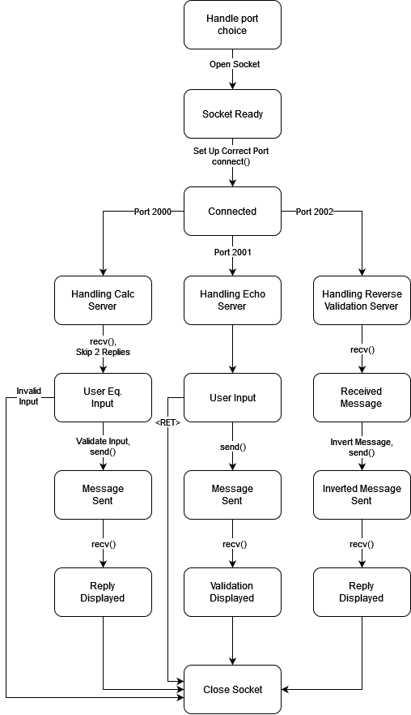

# KIV/UPS - 1. Bonus: Klient v jazyce C (s BSD sockety)

>Autor: Milan Vlachovský (A21B0318P)

## Zadání

- IP: 147.228.67.67 (nebo hostitelské jméno: kiv-ubl.kiv.zcu.cz)
- Porty (TCP):
  - 2000 (kalkulačka, která pošle formát zpráv jako první zprávu po připojení - vaším úkolem je vytvořit zprávy v zadaném formátu - vstup ideálně jako parametr příkazové řádky, nebo od uživatele, a to jednotlivě - operace, operand, operand)

  - 2001 (echo server, pošlete zprávu a zpět dostanete to samé jako odpověd - vaším úkolem je validovat odpověď)

  - 2002 (reverse, server vám vygeneruje string, vaším úkolem je poslat jej otočený zpět)

- Všechny zprávy jsou čistě textové a jsou zakončené ukončovacím znakem řádku (`\n`)

## Implementace

Vše se nachází uvnitř souboru `client.c`. Program lze dekomponovat následovně: 
  - Funkce main():
    1. Uživatelský výběr serveru na který se bude klient připojovat (dle portů). Výběr je realizován pomocí zadání příslučné číslice označující server:
       - 1 - Server s kalkulačkou
       - 2 - Echo server
       - 3 - Reverse server
    
        Na základě výběru se připraví handler obsluhující daný server.
    
    2. Otevření BSD socketu.

    3. Nakonfigurování *sockaddr_in* a připojení k serveru.

    4. Handling serveru:
       - Pro Server s kalkulačkou se jedná o funkci: *void handle_calc_server(...)*
       - Pro Echo server: *void handle_echo_server(...)*
       - Pro Reverse server: *void handle_reverse_server(...)*

    5. Uzavření socketu.

Klient se dá popsat následujícím stavovým diagramem:



Byl použit standardní postup k síťové komunikaci za použití jazyka C (knihovny `sys/socket.h, netinet/in.h a arpa/inet.h`). Pro uživatelský vstup a serverový výstup byly využity buffery s fixní velikostí, neboť se jedná o velmi jednoduchý klient. Program byl ručně testován pomocí nástroje `valgrind` a autorovi se nepodařilo najít žádný únik paměti.

## Struktura

- `client.c`
    - Je v něm veškerý zdrojový kód.

- `Makefile`
    - Na sestavení programu.

- `doc.html`
    - Odkaz na `Doxygen` dokumentaci.

- `docs/`
    - Složka s `Doxygen` dokumentací (v anglickém jazyce).

## Návod na spuštění a použití

1. Spustit příkaz `make`. Ten zkompiluje program do spustitelného souboru `client`.

    >Vizualizace konzole:
    ```
    $ make
    gcc client.o -o client
    ```


2. Spustit soubor `client`.

    >Vizualizace konzole:
    ```
    $ ./client
    Choose server:
    1 - calculator
    2 - echo server
    3 - reverse server

    ```

<br><br><br><br><br><br><br><br><br><br>

3. Vybrat požadovaný server (např. Server s kalkulačkou):

    >Vizualizace konzole:
    ```
    1
    Server ipv4 address: 147.228.67.67
    Chosen port: 2000
    Socket created
    Connected

    Enter <operand><operator><operand>
    Availible operators: +, -, /, *

    ```

4. Případný další vstup bude klient sám požadovat na základě vybraného serveru. 

5. Po úspěšné komunikaci se serverem se spojení a socket automaticky uzavře a program končí.