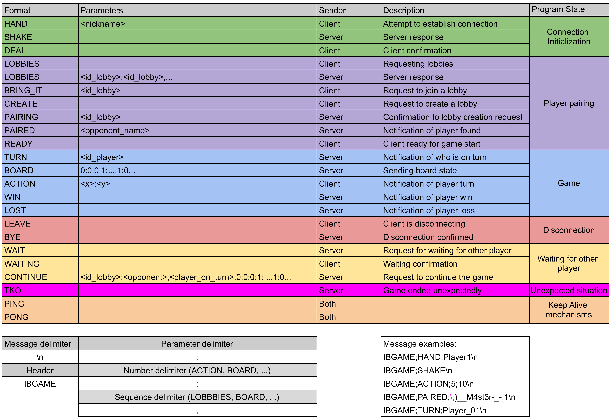
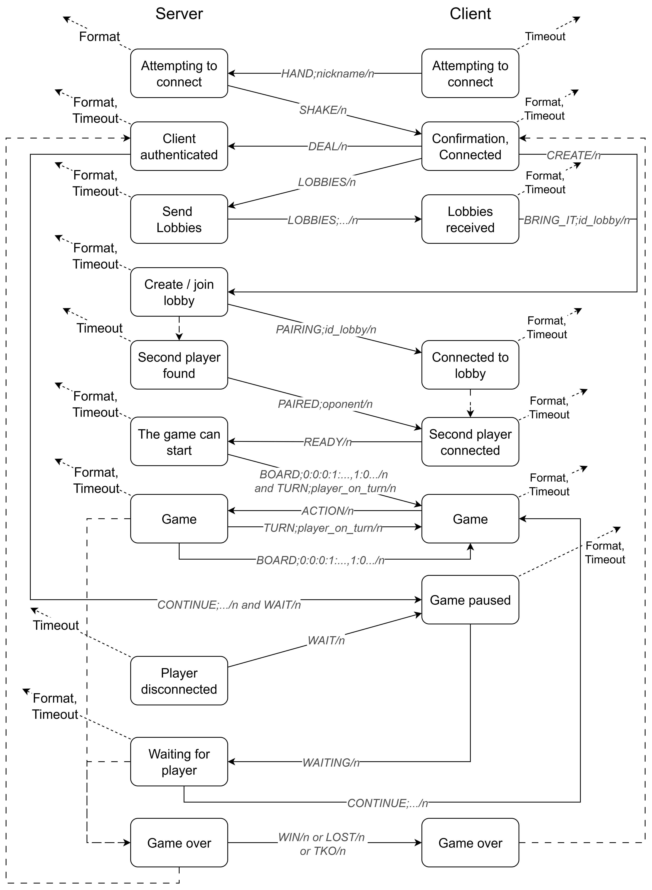

# <p style="text-align: center;">Documentation For Inverse Battleships Game</p>

> Author: Milan Vlachovský

## Contents

- [1. Introduction](#1-introduction)
- [2. Game Description](#2-game-description)
- [3. Network Protocol Description](#3-network-protocol-description)
- [4. System Architecture](#4-system-architecture)
- [5. Setup Guide](#5-setup-guide)
  - [5.1 Client](#51-client)
  - [5.2 Server](#52-server)
- [6. Project Structure](#6-project-structure)
- [7. Implementation Details](#7-implementation-details)
  - [7.1 Client](#71-client)
  - [7.2 Server](#72-server)
  - [7.3 Implementation specifics](#73-implementation-specifics)
- [8. Conclusion](#8-conclusion)

## 1. Introduction

<style>body {text-align: justify}</style>

The goal of this project was to create a simple multiplayer game that uses network communication with a server-side component written in a low-level programming language, and a client-side component in any programming language. The work was created initially as an university project. The author chose a custom variant of Battleships with modified rules called *“Inverse Battleships”*. As in the original, the game is for 2 players who take turns.
&nbsp;&nbsp;&nbsp;&nbsp;A TCP-based protocol was chosen. The server is implemented in Go due to its speed and low-level access to network communication. The client is implemented in Python using [pygame](https://www.pygame.org/news) to render the game’s GUI.

## 2. Game Description

*Inverse Battleships* is a variant of the classic Battleships game in which players try to find and capture/destroy all of the opponent’s ships. In this variant, players share a single 9×9 board and each is assigned one ship at the start. Players then alternate turns, and on each turn a player may try to perform an action on an empty tile. Three situations can occur:
<div style="page-break-after: always;"></div>

- The player acts on an empty tile that contains an unclaimed ship. In this case, the player acquires that ship and gains points.  

- The player acts on an empty tile that contains the opponent’s ship. In this case, the opponent loses the ship (it is destroyed), the player gains points, and the opponent loses points.

- The player acts on a tile where there is nothing. In this case, the player gains nothing.

The game ends when one of the players loses all ships. The winner is the surviving player. Points are purely for statistics and do not affect gameplay.

## 3. Network Protocol Description

Messages are sent in plaintext, unencrypted format. Each message ends with a newline character (ASCII 10). Every message must contain the predefined header *"IBGAME"*. This is followed by the command type and then any parameters. Each part of the message is separated by a semicolon *';'* (any additional, command-specific separators are listed in the [protocol definition](#protocol)). If you need to include the separator *';'* directly in a parameter value, escape it using the backslash *'\\'*.
&nbsp;&nbsp;&nbsp;&nbsp;All received messages are validated against the protocol. If a client message does not conform to the protocol, it is ignored and the client is disconnected. If a server response is invalid, the client terminates the connection and attempts to reconnect. For a valid command, the message is parsed into the required format (according to the [protocol definition](#protocol); e.g., the server’s LOBBIES command is parsed into a list of strings, the client’s ACTION command is parsed into two integers, etc.). If parsing fails, the message is ignored and the client is disconnected.


<div style="display: flex; justify-content: center;"><i>Table with protocol definition</i></div>

The following [diagram](#communication) shows simplified communication between the client and the server.


<div style="display: flex; justify-content: center;"><i>Diagram of simplified client–server communication</i></div>

Messages are highlighted in gray and italics. Messages from the client advance the server to the next states and vice versa. Spontaneous transitions (caused by external events such as finding an opponent, opponent returning, returning from a finished match, ...) are shown with a dashed line. For almost every state there is an outgoing edge indicating validation failure/disconnect/client timeout.

## 4. System Architecture

The system is divided into two parts: server and client. The server is written in Go and the client in Python using *pygame*. The server manages the game, communicates with clients, and validates messages. The client renders the GUI, processes user input, and communicates with the server.
&nbsp;&nbsp;&nbsp;&nbsp;In both parts, network communication is implemented at a low level using sockets (Python’s *socket* library and Go’s *net* library). This is a turn-based game where players alternate turns, so TCP was chosen as the protocol as it fits this kind of game.

### Requirements

The project was developed using the following technologies:

- Python 3.12
  - pygame 2.6.0
  - pydantic 2.8.2
  - typing-extensions 4.12.2
  - termcolor 2.5.0
  - pyinstaller 6.11.1
- Go 1.23

> Using the above technologies, the project should run without issues. Running on older versions was not tested and may not work correctly.

## 5. Setup Guide

To build the entire project, *Makefile* and *Makefile.win* were created with instructions for Unix and Windows OS. To build on Unix-like systems, run:

    make

and on Windows:

    make -f Makefile.win

It is assumed that `make` is installed; on Windows you can use [make from Chocolatey](https://community.chocolatey.org/packages/make), or other alternatives. 
&nbsp;&nbsp;&nbsp;&nbsp;The script creates executables in *client/bin/* for the client part and *server/bin/* for the server part. The executables are named *client* and *server*, or on Windows *client.exe* and *server.exe*.
> Since the client is implemented in Python, it can also be run without building. Just run *client/src/main.py* in a Python virtual environment with dependencies installed from *requirements.txt*. The client executables were produced using *[pyinstaller](https://pyinstaller.org/en/stable/)*, and build success can depend on the operating system and Python version.

> Per [PEP 394](https://peps.python.org/pep-0394/), the *Makefile* and *Makefile.win* assume the Python command is `python3` on Unix and `python` on Windows. If your setup differs, you must adjust the files.

### 5.1 Client

The client is written in Python; the code is interpreted line by line by the Python interpreter. To run the client, you need Python 3.12 and the dependencies listed in *requirements.txt*.

#### Step-by-step run

The author recommends creating a virtual environment and installing dependencies with the following commands:

> Commands are for Unix; adapt them for Windows.

```bash
python3 -m venv venv
source venv/bin/activate
pip install -r requirements.txt
cd client/
```

You can then start the client with:
```bash
python ./src/main.py
```

You can also run the client with a specific configuration and logging setup: 

```bash
python ./src/main.py -c ./cfg/debug_cfg.json \
-l ./cfg/debug_loggers_cfg.json

```

> By default, commands are expected to be run from the *client/* directory.
<div style="page-break-after: always;"></div>

#### Building the executable

Due to the nature of the language, you cannot create a standalone executable without external tools. The author chose to build with *pyinstaller*. 

To build the executable from the project root on Unix:
```bash
make client
```

Or on Windows:
```bash
make -f Makefile.win client
```

You can also build manually using the commands defined in the Makefiles.

### 5.2 Server

The server is written in Go. To build it, you need Go 1.23 or newer. Building again uses *Makefile* and *Makefile.win*. On Unix:
```bash
make server
```

On Windows:
```bash
make -f Makefile.win server
```

Make builds the executable in *server/bin/* named *server*.

#### Running the server

To run the server, pass either the IP address the server should listen on (the *-a* parameter) or specify a configuration file (the *-c* parameter). To run the server on 127.0.0.1 and port 8080:

> Commands are for Unix; adapt them for Windows.
```
./server/bin/server -a "127.0.0.1:8080"
```

> When choosing the IP address and port, make sure the address/port is available and not blocked by a firewall, etc.
<div style="page-break-after: always;"></div><p></p>

## 6. Project Structure

The project is organized as follows:

- *Root folder* — Contains the build files, the *client* and *server* folders, a *docs* folder with documentation, and *requirements.txt* with Python dependency definitions.
  - *client/* — The whole client part, including configuration files, text and image assets, and developer reference documentation.
  - *server/* — The whole server part, including configuration files and developer reference documentation.

### Root folder

- *Makefile* — Build script for Unix.
- *Makefile.win* — Build script for Windows.
- *client/* — Folder containing the client application code.

  - *client/Doxyfile* — Doxygen configuration.

  - *client/cfg/* — Client configuration files.
    - *client/cfg/debug_cfg.json* — Debug configuration.
    - *client/cfg/debug_loggers_cfg.json* — Logging configuration for debugging.
    - *client/cfg/debug_loggers_cfg_win.json* — Logging configuration for debugging on Windows.
    - *client/cfg/default_config.json* — Default configuration.
    - *client/cfg/default_user_config.json* — Default new-user configuration.
    - *client/cfg/loggers_config.json* — Logging configuration.
    - *client/cfg/users/* — Per-user configurations.

  - *client/docs/* — Client code documentation.

  - *client/res/* — Client assets.
    - *client/res/colors.json* — Color definitions used in the client GUI.
    - *client/res/img/** — Images used in the client GUI.
    - *client/res/strings.json* — Text string definitions used in the client GUI.<div style="page-break-after: always;"></div>

  - *client/src/* — Client source code.

    - *client/src/const/* — Constants.
      - *client/src/const/exit_codes.py* — Return code constants.
      - *client/src/const/loggers.py* — Logging constants.
      - *client/src/const/paths.py* — Path constants.
      - *client/src/const/typedefs.py* — Definitions of objects used in client code.

    - *client/src/game/* — Game management code.
      - *client/src/game/connection_manager.py* — Connection management with the server.
      - *client/src/game/ib_game.py* — Game logic manager.
      - *client/src/game/ib_game_state.py* — Game state.

    - *client/src/graphics/* — Client GUI code.
      - *client/src/graphics/game_session.py* — GUI for the game session.
      - *client/src/graphics/menus/* — GUI menus.
        - *client/src/graphics/menus/info_screen.py* — GUI for the info screen.
        - *client/src/graphics/menus/input_menu.py* — GUI for the input menu.
        - *client/src/graphics/menus/lobby_select.py* — GUI for lobby selection.
        - *client/src/graphics/menus/primitives.py* — GUI primitives.
        - *client/src/graphics/menus/select_menu.py* — GUI select menu.
        - *client/src/graphics/menus/settings_menu.py* — Settings menu.

      - *client/src/graphics/viewport.py* — Viewport abstraction for rendering any GUI.

    - *client/src/main.py* — Client entry point.<div style="page-break-after: always;"></div>

    - *client/src/util/* — Helper methods.
      - *client/src/util/assets_loader.py* — Loading assets (images, sounds, …).
      - *client/src/util/etc.py* — Misc helper methods.
      - *client/src/util/file.py* — File utility methods.
      - *client/src/util/generic_client.py* — Generic socket-based client.
      - *client/src/util/graphics.py* — Graphics helper methods.
      - *client/src/util/init_setup.py* — Client initialization.
      - *client/src/util/input_validators.py* — Input validators.
      - *client/src/util/loggers.py* — Custom logging.
      - *client/src/util/path.py* — Path utilities.

- *docs/* — Documentation folder.
  - *docs/doc.md* and *docs/doc.pdf* — This document in Markdown and PDF.
  - *docs/client_ref.html* — Link to client reference documentation.
  - *docs/server_ref.html* — Link to server reference documentation.

- *requirements.txt* — Python dependencies.

- *server/* — Server application code.

  - *server/cfg/* — Server configuration files.

  - *server/docs/* — Server code documentation.

  - *server/src/* — Server source code.

    - *server/src/const/* — Constants.
      - *server/src/const/const_file/const_file.go* — File-handling constants.
      - *server/src/const/custom_errors/custom_errors.go* — Error definitions.
      - *server/src/const/exit_codes/exit_codes.go* — Return code constants.
      - *server/src/const/msg/msg.go* — User-facing message definitions.
      - *server/src/const/protocol/server_communication.go* — Network protocol definitions.

    - *server/src/go.mod* — Go module definition.

    - *server/src/logging/logging.go* — Logging code.

    - *server/src/main.go* — Server entry point.<div style="page-break-after: always;"></div>

    - *server/src/server/* — Server management code.
      - *server/src/server/connection_manager.go* — Connection management.
      - *server/src/server/client_manager.go* — Client management.

    - *server/src/util/* — Utilities.
      - *server/src/util/arg_parser/arg_parser.go* — CLI argument parsing.
      - *server/src/util/cmd_validator/cmd_validator.go* — Network command validation.
      - *server/src/util/msg_parser/msg_parser.go* — Message parsing.
      - *server/src/util/util.go* — Helper functions.

## 7. Implementation Details

This section covers only the most important parts of the code needed to understand how the application works. For more detail, see the developer reference documentation available in *docs/client_ref.html* and *docs/server_ref.html* (these link to *client/docs/* and *server/docs/*).

> The reference documentation is available only in English.

### 7.1 Client

The client was implemented in Python using **pygame** for the GUI. The main components are split into modules by function.

> All code lives under *client/src/*.

> **Note on naming/encapsulation:**  
> In several places the Python client uses double leading underscores (e.g., `__example`) to mimic encapsulation via name-mangling. However, in Python the more appropriate and conventional way is to use a single leading underscore (e.g., `_example`) to indicate internal members.  
> For clarity, maintainability, and consistency with Python practices, **any future development or derivative works should replace double underscores with single underscores**. The naming choice does not affect current functionality so it was left unchanged for this project.

At runtime, a single main thread handles game logic, input processing, and GUI rendering. For asynchronous communication with the server, a dedicated thread is created, which uses synchronization primitives (Python *threading.Lock*, *threading.Event*, …) to process server messages and send responses.
&nbsp;&nbsp;&nbsp;&nbsp;On each game-state change, a new thread is started to handle server communication appropriate to that state. If the client receives an unexpected message from the server (corrupted, invalid, not allowed in the current game state, etc.), it disconnects and prints an error.
&nbsp;&nbsp;&nbsp;&nbsp;The program entry point is *main.py* and the `main()` function. It initializes the client application, loads configuration, loads assets, creates an instance of *IBGame* from *ib_game.py*, and starts the main game loop.<div style="page-break-after: always;"></div>

#### Client modules

1. **game** — Central module covering all game logic.
    - *connection_manager.py*
      - Manages the client’s socket connection to the server (using *generic_client.py*).
      - Provides an API for send/receive that *ib_game.py* uses.
    - *ib_game.py*
      - Manages overall game logic such as handling turns and synchronizing state with the server.
      - Manages the GUI and user input.
      - Holds game state and communicates with the server via *connection_manager.py* (network-thread methods are prefixed `__handle_net`).
      - Operates as a state machine, where each state corresponds to a game phase.
        - `main.py` repeatedly calls `update()`, which dispatches to sub-methods based on the current state (`__update_main_menu()`, `__update_game_session()`, …).
        - In each update sub-method, the GUI context is initialized, a new networking thread may be created (methods prefixed `__prepare`), inputs are processed (`__proccess_input(events)`), the GUI is updated (`update()` on the GUI context), changes are rendered (`draw()` or `redraw()` on the GUI context), and game state may be updated based on GUI/server feedback (methods prefixed `__handle_update_feedback`).
        - The call frequency of update methods depends on *tick_speed* (comparable to frames per second) set in the config via `clock.tick(tick_speed)` in the main loop.
        - When transitioning between game states, previously started threads are always terminated.
    - *ib_game_state.py*
      - Contains the class representing the game state.<div style="page-break-after: always;"></div>

2. **graphics** — GUI rendering module
    - *viewport.py*
      - Defines the *Viewport* base class, which all window-rendering classes must inherit.
      - Specifies the rendering/update contract that must be followed.
      - Each subclass of *Viewport* must implement:
        - `redraw()`: Repaint the entire window content.
        - `draw()`: Repaint only changed content.
        - `update(events)`: Update content based on changes (user input, server messages, …).
    - *game_session.py*
      - Renders the game environment and handles user interaction with the session.
    - *menus*
      - Modules for creating and managing menus like input screens, lobby, or settings.

3. **util** — Helper utilities
   - *assets_loader.py*: Loads graphics and other assets.
   - *generic_client.py*: Generic socket-based client for communicating with the server.
   - *loggers.py*: Custom logging for easier diagnostics and debugging.
   - *init_setup.py*: Client initialization.

#### Client libraries used

- **pygame 2.6.0**: GUI rendering.
- **pydantic 2.8.2**: Data validation.
- **termcolor 2.5.0**: Colored terminal logging.
- **pyinstaller 6.11.1**: Building executables.

#### Client parallelism

The client uses *threading* to manage asynchronous communication with the server, allowing server messages to be processed concurrently with rendering and input handling. When each game state is initialized, the GUI context is prepared and a networking thread may be created and started. The thread processes server messages and propagates changes to the main thread:

- using a *threading.Lock* (`self.net_lock`) to:
  - modify the variable representing game state (`self.game_state`),
  - modify a special variable for managing the game session (`self.__game_session_updates`);
- by clearing the reference to the current GUI context, which forces the next cycle’s initialization method to prepare a new GUI context, start a new thread, …

Communication from the main thread to network threads uses:

- *threading.Event* (`self.__end_net_handler_thread`, `self.do_exit`) to signal thread termination,
- *queue.Queue* (`self.__action_input_queue`) to pass messages from the game session to the network thread.
<div style="page-break-after: always;"></div>

### 7.2 Server

The server was implemented in Go for its speed and efficient concurrency. Only Go’s standard libraries were used (for networking, the *net* package). The server is divided into modules by function.

> All code lives under *server/src/*.

The server entry point is *main.go*, which loads configuration, creates a server instance and a client manager, and starts the main game-server loop (function `manageServer()`). The server is divided into three main modules: *server*, *util*, and *const*.

#### Server modules

1. **server** — Central module covering server logic.
   - *connection_manager.go*
      - Represents a single connection between the server and a client.
      - Defines the server structure represented by an IP address and a *net.Listener*.
      - Contains methods to accept new connections, process their messages, and send messages.<div style="page-break-after: always;"></div>
   - *client_manager.go*
      - Manages all clients connected to the server and the logic associated with the running game server.
      - The main function is `ManageServer()`, which contains the main server loop running on the main thread.
      - Listens for SIGINT and SIGTERM to shut down gracefully.
      - Uses shared structures (maps) to manage un/authenticated clients and lobbies.
      > On each access to shared structures (e.g., clients, lobbies, …), *client_manager* uses RW mutexes to ensure safe synchronized access.
      - The main server loop proceeds as follows:
        1. Checks control variables for server shutdown.
        2. Calls the function that manages all active lobbies hosted on the server (`ManageLobbies()`).
            - This function manages game sessions. Based on each lobby’s state, it places it into queues for processing (`lobbiesToStart`, `lobbiesToAdvance`, `lobbiesToDelete`, ...).
            - All lobbies are then processed and advanced to the next state if possible (functions prefixed `manageLobbies`).
            - When it needs to send informational messages to clients, it uses a per-client *send* lock (or sends in parallel using goroutines that only send and then exit).
        3. Checks whether a new client is trying to connect. If so, it creates a new connection and a new goroutine (thread) that will continuously process that client’s interactions until disconnection.
            > Each new client has *recv* and *send* mutexes to ensure safe exclusive access to socket operations.
            - It first attempts to authenticate and log in the client (according to the protocol contract). On failure, it disconnects the client and removes it from shared structures.
            - It then processes client messages and performs corresponding actions (e.g., create a new game session, join an existing session, prepare a lobby state change based on a client command, …). These are functions prefixed *handle* (`handlePingCmd`, `handleJoinLobbyCmd`, …). For invalid or disallowed commands, the client is disconnected and removed from shared structures, and the client’s lobby may be marked for deletion.<div style="page-break-after: always;"></div>

2. **util** — Utilities.
   - *arg_parser.go*: Parses command-line arguments when starting the server.
   - *cmd_validator.go*: Validates commands received from clients.
   - *msg_parser.go*: Formats messages for sending and receiving.

3. **const** — Constants.
   - *protocol/server_communication.go*: Protocol and message format definitions between client and server.

4. **logging** — Logging.
   - *logging.go*: Implements logging for easier diagnostics and debugging.

#### Server libraries used

- Go standard libraries: *net*, *os*, *fmt*, *sync*, *time*, ...

#### Concurrency

The server uses goroutines to handle client requests concurrently. Mutexes and channels are used for data synchronization. Each new client has its own mutexes to ensure safe access to sockets. The server uses *sync.RWMutex* to safely access shared structures (client maps, lobbies, ...).

### 7.3 Implementation specifics

#### Network communication

Because sending/receiving messages over BSD sockets is affected by the OS’s implementation, it was necessary to handle situations where multiple messages might arrive at once or a message might be split into parts. Both client and server keep a buffer for each connection, into which they can store extra data and process it during the next receive call. If a full message does not arrive, the receive request is repeated until the message is complete or the timeout for processing the entire message expires. A drawback is that if an incomplete message arrives followed immediately by another, this time valid, message, the connection would be considered invalid and disconnected. This approach is sufficient for a project of this size, but for larger projects it would be advisable to implement message retransmission requests.
<div style="page-break-after: always;"></div>

## 8. Conclusion

The creation of a simple networked game for two players was successful. The game is called *Inverse Battleships* and is inspired by classic Battleships. The project is split into a Python client and a Go server. The project required handling asynchronous communication using threads on the client side and goroutines on the server side.
&nbsp;&nbsp;&nbsp;&nbsp;A custom TCP-based protocol was used for network communication. Connections are implemented at a low level using BSD sockets. Unencrypted plaintext messages are sent over the protocol, separated and parsed based on delimiters and protocol rules.
&nbsp;&nbsp;&nbsp;&nbsp;The game is fully functional and can be played between two players. It responds to player input and displays the game state in the GUI. It can also react to unexpected input (by disconnecting) and recover from short-term server/client unavailability.
&nbsp;&nbsp;&nbsp;&nbsp;This project provides a foundation for further extensions, such as encrypting messages or adding more game rules. It also serves as a useful study resource for understanding the basics of network communication and game design.
